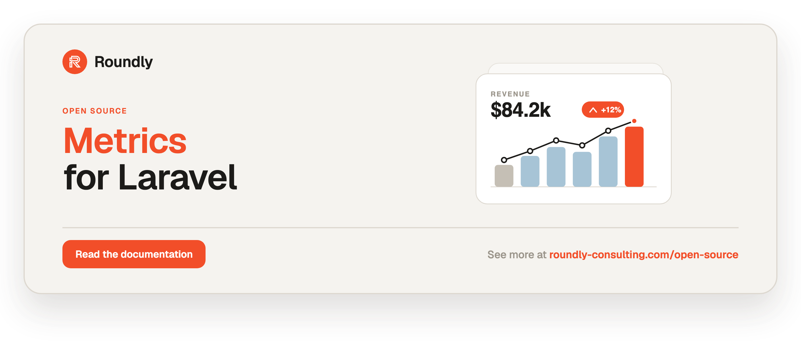

<!-- roundly-hero:start -->
<p align="center">
  <a href="https://roundly-consulting.com/open-source/docs/metrics-for-laravel?utm_source=github&utm_medium=readme&utm_campaign=open-source&utm_content=metrics-for-laravel">
    
  </a>
</p>
<!-- roundly-hero:end -->

<!-- roundly-badges:start -->
<p align="center">
  <a href="https://packagist.org/packages/roundly-consulting/metrics-for-laravel"></a>
  <a href="https://github.com/roundly-consulting/metrics-for-laravel/actions/workflows/run-tests.yml"></a>
  <a href="https://github.com/roundly-consulting/metrics-for-laravel/actions/workflows/fix-php-code-style-issues.yml"></a>
  <a href="https://donate.stripe.com/dRmeVe8FX5PF1Qd9pXcEw00"></a>
  <a href="https://www.patreon.com/cw/roundly"></a>
</p>
<!-- roundly-badges:end -->

# Metrics for Laravel

Calculate value, trend, progress, and partition metrics from any Eloquent query.

`metrics-for-laravel` turns an Eloquent query into a ready-to-render metric — a single
value with period-over-period change, a time series for charts, a progress bar against a
target, or a partitioned breakdown for pie/bar charts. Build a metric inline in one fluent
expression, or define a small reusable class. The package handles date ranges, aggregation,
grouping, caching, and formatting, and hands back clean JSON-friendly data — Nova-style
metrics without Nova, for any front-end.

## Requirements

- PHP 8.4+
- Laravel 12 or 13

## Installation

```bash
composer require roundly-consulting/metrics-for-laravel
```

The service provider and the `Metric` facade are auto-discovered. The package works against
your existing models and tables — there are no migrations.

Optionally publish the config file:

```bash
php artisan vendor:publish --tag="metrics-config"
```

## Quick start

Build a metric inline with the `Metric` facade — no class required:

```php
use App\Models\User;
use RoundlyConsulting\Metrics\Enums\Period;
use RoundlyConsulting\Metrics\Facades\Metric;

$data = Metric::value()
    ->count(User::query())
    ->range(Period::Today)
    ->withChangeAgainstPreviousPeriod()
    ->toArray();
```

The facade exposes one builder per metric type — `Metric::value()`, `Metric::trend()`,
`Metric::progress()`, and `Metric::partition()`:

```php
Metric::trend()->count(User::query(), 'created_at')->daily()->range(Period::MonthToDate)->toArray();
Metric::progress()->sum(Order::query(), 'total')->target(10000)->range(Period::MonthToDate)->toArray();
Metric::partition()->count(User::query(), 'plan')->toArray();
```

## Metric types (reusable classes)

For metrics you reuse across a dashboard, define a class by extending the base type and
implementing `calculate()`, which returns the matching result object.

| Type | Extend | `calculate()` returns | Good for |
|---|---|---|---|
| Value | `RoundlyConsulting\Metrics\Types\Value\Value` | `ValueResult` | a single number, optionally vs. the previous period |
| Trend | `RoundlyConsulting\Metrics\Types\Trend\Trend` | `TrendResult` | a time series (line/area chart) |
| Progress | `RoundlyConsulting\Metrics\Types\Progress\Progress` | `ProgressResult` | current value vs. a target (progress bar) |
| Partition | `RoundlyConsulting\Metrics\Types\Partition\Partition` | `PartitionResult` | a grouped breakdown (pie/bar chart) |

### Value

```php
use App\Models\User;
use RoundlyConsulting\Metrics\Types\Result;
use RoundlyConsulting\Metrics\Types\Value\Value;

final class RegisteredUsers extends Value
{
    protected function calculate(): Result
    {
        return $this->count(User::query());
    }
}

RegisteredUsers::make()->range('TODAY')->toArray();
```

### Trend

```php
use App\Models\User;
use RoundlyConsulting\Metrics\Types\Result;
use RoundlyConsulting\Metrics\Types\Trend\Trend;

final class RegisteredUsersTrend extends Trend
{
    protected function calculate(): Result
    {
        return $this->count(User::query(), 'created_at');
    }
}

RegisteredUsersTrend::make()->hourly()->range('TODAY')->toArray();
```

### Progress

A Progress metric compares the current value to a `target`. Use `shouldBeAvoided()` when the
target is a ceiling you want to stay **under** (an error budget or a spend cap) rather than a
goal to **reach**.

```php
use App\Models\Subscription;
use RoundlyConsulting\Metrics\Types\Progress\Progress;
use RoundlyConsulting\Metrics\Types\Result;

final class MonthlyRevenueGoal extends Progress
{
    protected function setup(): void
    {
        $this->target(10000)->range('MTD');
    }

    protected function calculate(): Result
    {
        return $this->sum(Subscription::query(), 'amount');
    }
}
```

### Partition

```php
use App\Models\User;
use RoundlyConsulting\Metrics\Types\Partition\Partition;
use RoundlyConsulting\Metrics\Types\Result;

final class UsersByPlan extends Partition
{
    protected function calculate(): Result
    {
        // count of users grouped by the `plan` column
        return $this->count(User::query(), 'plan');
    }
}
```

## Registry

Register your dashboard's metrics under short keys and resolve them by name — ideal for an
endpoint that returns many tiles at once:

```php
use RoundlyConsulting\Metrics\Facades\Metric;

// in a service provider boot()
Metric::register('registered_users', RegisteredUsers::class);
Metric::register('revenue', MonthlyRevenueGoal::class);
Metric::register('users_by_plan', fn () => UsersByPlan::make());

// in a controller
return response()->json(
    collect(Metric::all())->map->toArray()
);

// or a single metric by key, applying the request's period
return response()->json(
    Metric::get($key)->range($request->input('period', 'TODAY'))->toArray()
);
```

Register a class-string, an instance, or a closure. `Metric::get()` throws
`RoundlyConsulting\Metrics\Exceptions\UnknownMetricException` for an unregistered key.
`Metric::keys()` lists the registered keys without resolving them.

## Dashboards (batch resolution)

Resolve many registered metrics at once into a single keyed envelope, sharing one range
(and, optionally, one timezone):

```php
use RoundlyConsulting\Metrics\Enums\Period;
use RoundlyConsulting\Metrics\Facades\Metric;

return Metric::dashboard(['users', 'revenue', 'churn'])
    ->range(Period::ThisMonth)
    ->toArray();
// ['users' => [...envelope...], 'revenue' => [...], 'churn' => [...]]
```

The dashboard is `Responsable`, so a controller can `return Metric::dashboard([...])->range(...)`
directly and get the JSON envelope.

## Returning metrics from controllers

Metrics and dashboards implement `Illuminate\Contracts\Support\Responsable`, so you can return
one straight from a controller and get its JSON envelope — authorization stays your app's
responsibility:

```php
public function show(string $key)
{
    return Metric::get($key)->range(request('period', 'TODAY'));
}
```

## Comparison periods

`Value` and `Progress` metrics expose period-over-period change. By default the comparison is
the immediately-preceding window; `compareTo()` compares against any range instead:

```php
use RoundlyConsulting\Metrics\Enums\Period;

Metric::value()
    ->count(Order::query())
    ->range(Period::ThisMonth)
    ->compareTo(Period::LastYear)   // vs. the same metric a year ago
    ->toArray();
```

## Top N partitions

Cap a partition to its largest groups and roll the rest into a single bucket:

```php
Metric::partition()
    ->count(User::query(), 'country')
    ->limit(5)                       // 5 groups + "Other"
    ->otherLabel('Elsewhere')        // optional; defaults to the translatable "Other"
    ->toArray();
```

Map raw group keys to display labels with `labelUsing()` — raw keys stay available via the
result's `keys()`, and the labels appear under a `labels` key:

```php
Metric::partition()
    ->count(User::query(), 'country_id')
    ->labelUsing(fn (int|string $key): string => Country::name($key))
    ->toArray();
// result => ['partitions' => ['1' => 40.0, ...], 'labels' => ['1' => 'Germany', ...]]
```

## Console commands

Inspect your registered metrics from the CLI:

```bash
php artisan metrics:list              # every registered key and its class
php artisan metrics:show users        # resolve "users" and print its envelope
php artisan metrics:show users --range=MTD
```

## Events

A `RoundlyConsulting\Metrics\Events\MetricCalculated` event fires every time a metric resolves —
useful for instrumentation and slow-metric logging. It carries the registry `key` (null for
ad-hoc metrics), the `range`, the `durationMs`, and whether it was served `fromCache`:

```php
use Illuminate\Support\Facades\Event;
use RoundlyConsulting\Metrics\Events\MetricCalculated;

Event::listen(function (MetricCalculated $event): void {
    if ($event->durationMs > 500) {
        logger()->warning("Slow metric [{$event->key}] took {$event->durationMs}ms");
    }
});
```

## Testing helper

`Metric::fake()` swaps the registry for a recording fake so host-app tests can stub metric
results and assert what was resolved — mirroring Laravel's `Http::fake()`:

```php
use RoundlyConsulting\Metrics\Facades\Metric;

$fake = Metric::fake([
    'active-users' => 1200,                  // a number becomes a value envelope
    'revenue'      => ['value' => 5000.0],   // an array is used as the raw result
]);

// ...exercise the code under test...

Metric::assertResolved('active-users');
$fake->assertResolvedTimes('active-users', 1);
$fake->assertNotResolved('revenue');
$fake->assertNothingResolved();
```

Canned values may be a number, an array (raw result), a `Result`, or a full `Metrics`
instance.

## Configuring a metric

Override presentation and behaviour inline (fluent calls) or inside the metric's `setup()`
method. By default a metric's name is the humanized class name (`RegisteredUsers` →
"Registered Users").

### Available methods

All metric types:

- `name(string $name)`
- `description(string $description)`
- `prefix(string $prefix)`
- `suffix(string $suffix)`
- `precision(int $precision = 0, RoundingMode $mode = RoundingMode::HalfAwayFromZero)`
- `range(Period|string $range, ?string $customRangeStart = null, ?string $customRangeEnd = null)`
- `timezone(?string $timezone)` — resolve this metric's ranges in an explicit timezone,
  overriding `config('metrics.timezone')` and the app timezone
- `ranges(): array` — the list of available range keys/labels
- `formatUsing(Closure(float): string $formatter)` — see [Number formatting](#number-formatting)
- `cache()`, `cacheFor()`, `cacheKey()`, `dontCache()` — see [Caching](#caching)

Value & Progress:

- `withChangeAgainstPreviousPeriod(bool $withChange = true)`
- `compareTo(Period|string $range, ?string $customRangeStart = null, ?string $customRangeEnd = null)` —
  compare against an arbitrary range instead of the immediately-previous period (implies change)

Progress:

- `target(float $target)`
- `shouldBeAvoided(bool $avoid = true)`

Trend (unit helpers):

- `unit(Unit|string $unit)` — a `Unit` case or `MINUTE`, `HOUR`, `DAY`, `WEEK`, `MONTH`, `YEAR`
- `perMinute()`, `hourly()`, `daily()`, `weekly()`, `monthly()`, `yearly()`
- `withoutGapFilling()` — return only buckets that have rows (see [Trend units](#trend-units))
- `groupBy(string $column)` — split into multiple series (see [Trend units](#trend-units))

Partition:

- `limit(int $limit)` — cap to the top N groups, rolling the rest into an "Other" bucket
- `otherLabel(string $label)` — override the "Other" bucket label
- `labelUsing(Closure(int|string): string $resolver)` — map raw group keys to display labels

> `precision()` takes PHP's native `RoundingMode` enum, e.g.
> `->precision(2, RoundingMode::HalfEven)`.

## Enums

Ranges and units are backed by string enums for IDE autocomplete and type safety. Strings are
still accepted everywhere, so existing code keeps working:

```php
use RoundlyConsulting\Metrics\Enums\Period;
use RoundlyConsulting\Metrics\Enums\Unit;

$metric->range(Period::MonthToDate);   // identical to ->range('MTD')
$metric->unit(Unit::Hour);             // identical to ->unit('HOUR')
$metric->range(Period::Custom, '2024-01-01 00:00:00', '2024-03-01 00:00:00');
```

Both enums use the shared [`roundly-consulting/enums-for-laravel`](https://github.com/roundly-consulting/enums-for-laravel)
helper trait, so they expose a full toolkit for building host selects and validation rules:

```php
Period::toOptions()->all();   // ['7' => '7 Days', ..., 'ALL' => 'All'] — value => label map
Period::options();            // Collection<EnumOption> of {value, label, name} DTOs for JS/Inertia
Period::validationRule();     // 'in:7,14,30,...,ALL'
Unit::toOptions()->all();     // ['MINUTE' => 'Minute', ..., 'YEAR' => 'Year']
Unit::validationRule();       // 'in:MINUTE,HOUR,DAY,WEEK,MONTH,YEAR'
Unit::labels();               // Collection<string> of readable labels
```

## Aggregate helpers

Use these inside `calculate()` (or via the inline builders) to compute the result from an
Eloquent query.

**Value, Progress and Trend** — `$column` is the aggregated column, `$dateColumn` is the
column used for period filtering (defaults to the model's `created_at`):

- `count(Builder $query, ?string $column = null, ?string $dateColumn = null)`
- `average(...)`, `sum(...)`, `max(...)`, `min(...)` — same signature

> For **Trend** metrics, `$column` is required (it is the value aggregated over time).

**Partition** — `$groupBy` is the column to group by, `$valueColumn` is the aggregated column
(defaults to `$groupBy`), `$dateColumn` defaults to `created_at`:

- `count(Builder $query, string $groupBy, ?string $valueColumn = null, ?string $dateColumn = null)`
- `average(...)`, `sum(...)`, `max(...)`, `min(...)` — same signature

## Date ranges

Filter any metric with `range()`. The available keys come from `ranges()` /
`Period::toOptions()`:

| Key | Label | Key | Label |
|---|---|---|---|
| `7` | 7 Days | `THIS_WEEK` | This Week |
| `14` | 14 Days | `LAST_WEEK` | Last Week |
| `30` | 30 Days | `THIS_MONTH` | This Month |
| `60` | 60 Days | `LAST_MONTH` | Last Month |
| `90` | 90 Days | `THIS_QUARTER` | This Quarter |
| `365` | 365 Days | `LAST_QUARTER` | Last Quarter |
| `YESTERDAY` | Yesterday | `THIS_YEAR` | This Year |
| `TODAY` | Today | `LAST_YEAR` | Last Year |
| `WTD` | Week To Date | `CUSTOM` | Custom |
| `MTD` | Month To Date | `ALL` | All |
| `QTD` | Quarter To Date | | |
| `YTD` | Year To Date | | |

```php
$metric->range('MTD');                 // month to date
$metric->range(Period::ThisQuarter);   // the full current quarter
$metric->range('CUSTOM', '2024-01-01 00:00:00', '2024-03-01 00:00:00');
```

Ranges resolve in `config('metrics.timezone')` (falling back to the app timezone). Labels run
through Laravel's translator, so they can be localised in your app's translation files.

## Trend units

Trend results are grouped by a date column formatted to the chosen unit (default `DAY`).
Available units are `MINUTE`, `HOUR`, `DAY`, `WEEK`, `MONTH`, and `YEAR`. Grouping uses a
database-specific SQL date expression: **MySQL, MariaDB, PostgreSQL, and SQLite** are
supported out of the box. To support another driver, map it in
`config('metrics.trend_drivers')` or register an implementation of
`RoundlyConsulting\Metrics\Types\Trend\QueryExpressions\QueryExpression` in
`Trend::$queryExpressions` keyed by the driver name.

### Gap filling

Every bucket in the selected range is present in the output — empty buckets are filled with
`0` so charts have a continuous axis. Opt out with `withoutGapFilling()` to return only the
buckets that actually have rows:

```php
Metric::trend()->count(User::query(), 'created_at')->daily()->withoutGapFilling()->toArray();
```

### Multi-series trends

Split a trend by a dimension with `groupBy()`. The combined totals stay under `trends`, and
an additive `series` key holds one bucket set per dimension value:

```php
Metric::trend()->count(User::query(), 'created_at')->daily()->groupBy('plan')->toArray();
// result => [
//   'trends' => ['2024-01-01' => 30.0, ...],            // totals across series
//   'series' => [
//     'pro'  => ['2024-01-01' => 20.0, ...],
//     'free' => ['2024-01-01' => 10.0, ...],
//   ],
// ]
```

Each series is gap-filled across the same range, so every series shares the same buckets.

## Caching

Caching is **off by default**. Enable it globally via config, or per metric:

```php
Metric::value()->count(User::query())->range('TODAY')->cacheFor(now()->addHour())->toArray();

$metric->cache(120);          // cache for 120 seconds
$metric->cacheKey('users');   // override the derived cache key
$metric->dontCache();         // force a fresh computation
```

The cache key is derived from the metric class, range, unit, and target, so different
configurations never collide. Only the `result` portion is cached.

Globally, `METRICS_CACHE_ENABLED` accepts `true`/`false`/`1`/`0`/`on`/`off`, and
`METRICS_CACHE_TTL` is a whole number of seconds between `1` and `31536000` (one year) — the
string `.env` produces is honoured. An unusable TTL throws
`RoundlyConsulting\Metrics\Exceptions\InvalidConfigurationException` instead of silently
falling back to 300 seconds.

## Number formatting

Present values as currency, percentages, or abbreviated figures without touching your
front-end. The formatted output appears under a `formatted` key alongside the raw value:

```php
use Illuminate\Support\Number;

Metric::value()
    ->sum(Order::query(), 'total')
    ->formatUsing(fn (float $value): string => Number::currency($value, 'USD'))
    ->toArray();
// result.value => 1500.0, result.formatted => "$1,500.00"
```

For trends and partitions the formatter is applied to every point.

## Typed result accessors

Result objects expose typed getters for chart consumers, in addition to `toArray()`:

- `ValueResult`: `value()`, `previous()`, `change()`, `isIncrease()`
- `TrendResult`: `trends()`, `series()`, `labels()`, `values()`
- `ProgressResult`: `value()`, `progress()`, `target()`, `previous()`, `isIncrease()`
- `PartitionResult`: `partitions()`, `labels()`, `keys()`, `values()`

## Configuration

The published `config/metrics.php` documents every key:

| Key | Type | Default | Env |
|---|---|---|---|
| `timezone` | `?string` | `null` (app timezone) | `METRICS_TIMEZONE` |
| `default_range` | `string` | `ALL` | — |
| `default_unit` | `string` | `DAY` | — |
| `precision` | `int` | `0` | — |
| `cache.enabled` | `bool` | `false` | `METRICS_CACHE_ENABLED` |
| `cache.store` | `?string` | `null` (default store) | `METRICS_CACHE_STORE` |
| `cache.ttl` | `int` (1–31536000 s; digit strings accepted) | `300` | `METRICS_CACHE_TTL` |
| `cache.prefix` | `string` | `metrics` | — |
| `partition.other_label` | `string` | `Other` | — |
| `trend_drivers` | `array` | mysql/mariadb/pgsql/sqlite | — |

## Integrates with

- **[`roundly-consulting/enums-for-laravel`](https://github.com/roundly-consulting/enums-for-laravel)**
  (required) — the `Period` and `Unit` enums adopt its `Helpers` trait, giving you
  `options()`/`toOptions()`/`labels()`/`values()`/`names()`/`validationRule()` plus name- and
  label-based case lookups for host selects and validation. See [Enums](#enums).
- **[`roundly-consulting/package-toolkit-for-laravel`](https://github.com/roundly-consulting/package-toolkit-for-laravel)**
  (required) — the package is bootstrapped with the toolkit's `PackageServiceProvider`, so its
  config, publish tag and console commands are wired through the shared builder, and
  `php artisan about` reports the registered metric count, the result-cache state and the default
  range.

### Recipe: an event → metric sink

`metrics-for-laravel` reads from your existing tables, so any other package's domain events can
feed a metric with **no extra dependency** — this is host wiring, not a package `require`. Point a
metric at the model the event writes, or record a lightweight counter and count that:

```php
use App\Models\Order;
use Illuminate\Support\Facades\Event;
use RoundlyConsulting\Metrics\Facades\Metric;

// Register a metric over whatever table the events already populate.
Metric::register('orders_today', fn () => Metric::value()->count(Order::query())->range('TODAY'));

// Or fan a package's event into your own metrics table, then build a metric over it.
Event::listen(OrderPlaced::class, function (OrderPlaced $event): void {
    MetricEvent::create(['name' => 'order_placed', 'occurred_at' => now()]);
});

Metric::register('orders_placed', fn () => Metric::trend()
    ->count(MetricEvent::query()->where('name', 'order_placed'), 'occurred_at')
    ->daily());
```

## Testing

```bash
composer test
```

## Changelog

Please see [CHANGELOG](CHANGELOG.md) for more information on what has changed recently.

## Contributing

Please see [CONTRIBUTING](https://github.com/roundly-consulting/.github/blob/main/CONTRIBUTING.md) for details.

## Security Vulnerabilities

Please review [our security policy](../../security/policy) on how to report security
vulnerabilities.

## Credits

- [Andrej Mihaliak](https://github.com/mihaliak)
- [All Contributors](../../contributors)

<!-- roundly-support:start -->
## Support our work

This package is free and open source, built and maintained by
[Roundly Consulting](https://roundly-consulting.com/open-source?utm_source=github&utm_medium=readme&utm_campaign=open-source&utm_content=metrics-for-laravel).
If it saves you time, please consider supporting our open-source work — a one-time donation or a
monthly pledge on Patreon helps fund maintenance, new features and new packages.

<a href="https://donate.stripe.com/dRmeVe8FX5PF1Qd9pXcEw00"></a>
<a href="https://www.patreon.com/cw/roundly"></a>
<!-- roundly-support:end -->

## License

The MIT License (MIT). Please see [License File](LICENSE.md) for more information.
